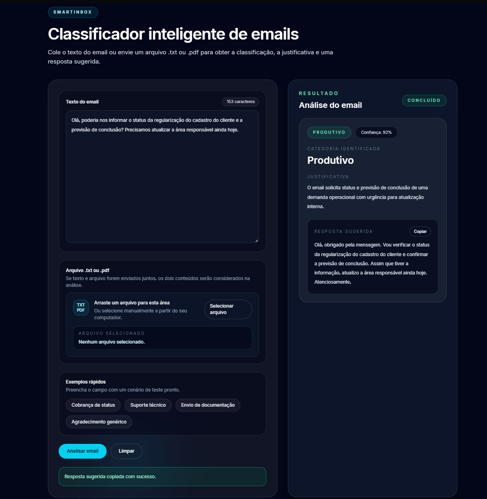
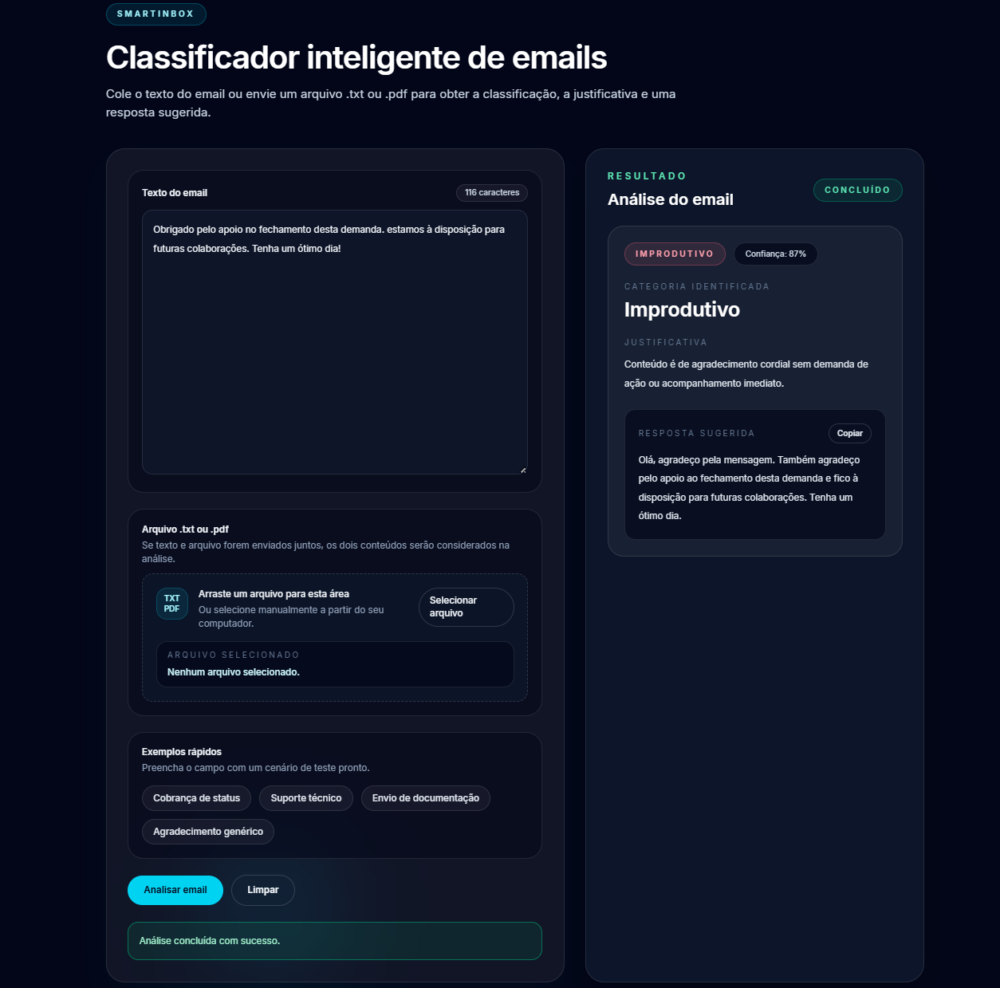

# SmartInbox

Aplicação web para classificação inteligente de emails corporativos com `FastAPI`, `HTML`, `JavaScript` e `Tailwind CSS` compilado via executável.

O sistema permite:
- colar o texto de um email;
- enviar um arquivo `.txt` ou `.pdf`;
- classificar o conteúdo em `Produtivo` ou `Improdutivo`;
- exibir justificativa curta;
- sugerir uma resposta profissional.

## Visão geral

O fluxo principal da aplicação é:

1. o usuário envia texto, arquivo ou ambos;
2. o backend extrai o conteúdo do arquivo quando necessário;
3. o `TextPreprocessorService` limpa ruído, reduz excesso de conteúdo e aplica o pipeline de NLP;
4. o `AnalysisOrchestratorService` organiza o fluxo de análise;
5. o `OpenAIEmailAnalyzerService` retorna `category`, `reason`, `suggested_reply` e `confidence`;
6. a interface mostra o resultado de forma amigável.

## Funcionalidades principais

- entrada manual de texto;
- upload de `.txt` e `.pdf`;
- drag and drop para upload;
- possibilidade de combinação entre corpo do email e anexo quando ambos são enviados;
- classificação em `Produtivo` ou `Improdutivo`;
- cópia de uma resposta sugerida ;
- contador de caracteres;
- exemplos prontos para teste;
- fallback local opcional para análise sem OpenAI.

Observação sobre fallback:

- `ENABLE_LOCAL_AI_FALLBACK` vem como `false` por padrão;
- se quiser ativar o fallback local, basta definir `ENABLE_LOCAL_AI_FALLBACK=true` no `.env`.

## Dados de exemplo

### Exemplo Produtivo



### Exemplo Improdutivo



## Pré-requisitos

- Python 3.11+;
- `tailwindcss.exe` na raiz do projeto;
- chave da OpenAI para análise real.

### Tailwind CSS Standalone CLI

Este projeto usa o `Tailwind CSS Standalone CLI`, sem Node.js.

Se você ainda não tiver o executável, baixe a versão oficial para o seu sistema em:

https://github.com/tailwindlabs/tailwindcss/releases

Depois, coloque o arquivo `tailwindcss.exe` na raiz do projeto.

## Configuração de ambiente

Crie um arquivo `.env` com base no `.env.example`.

Exemplo:

```env
OPENAI_API_KEY=sua_chave_aqui
OPENAI_MODEL=gpt-5-nano
ENABLE_LOCAL_AI_FALLBACK=false
```

## Instalação local

1. Crie e ative um ambiente virtual.
2. Instale as dependências:

```powershell
pip install -r requirements.txt
```

3. Verifique se o `tailwindcss.exe` está na raiz do projeto.
4. Configure o `.env`.

## Desenvolvimento (modo watch)

Durante o desenvolvimento, o CSS deve ser recompilado automaticamente para refletir mudanças nas classes Tailwind em tempo real.

Primeiro, execute o Tailwind em modo watch:

```powershell
.\tailwindcss.exe -i ./tailwind-input.css -o ./app/static/output.css --watch
```

Depois, inicie o servidor FastAPI com reload automático:

```powershell
uvicorn app.main:app --reload
```

Explicação:

- `--watch` recompila o CSS automaticamente ao editar classes Tailwind;
- `--reload` reinicia o servidor ao alterar código Python.

Esse fluxo permite ver as alterações em tempo real no navegador.

## Build final do CSS

Antes de executar a aplicação em modo final, o CSS deve ser compilado em versão otimizada.

Execute:

```powershell
.\tailwindcss.exe -i ./tailwind-input.css -o ./app/static/output.css --minify
```

Explicação:

- `--minify` gera um CSS menor e otimizado para execução final.

## Executar aplicação 

Depois de gerar o CSS final, inicie apenas o servidor:

```powershell
python -m uvicorn app.main:app --port 8000
```

Explicação:

- nesse modo não é necessário usar `--reload`;
- o CSS já estará compilado;
- esse é o modo recomendado para executar a aplicação normalmente.

Observação:

- se você não pretende alterar o projeto, o design ou as classes Tailwind, pode começar direto por esta etapa, desde que o CSS final já esteja compilado.

## Testar a API com FastAPI /docs

Como o backend usa `FastAPI`, a forma mais simples de testar a API localmente é pela documentação interativa automática.

No ambiente de desenvolvimento, rode:

```powershell
uvicorn app.main:app --reload
```

Depois abra no navegador:

```text
http://127.0.0.1:8000/docs
```

Lá você poderá:

- testar `POST /api/v1/analyze` sem usar `curl`;
- enviar `text`;
- enviar `file`;
- verificar a resposta JSON diretamente pela interface do FastAPI.

## Rotas disponíveis

- `GET /`
- `GET /health`
- `POST /api/v1/analyze`
- `GET /docs`

## Exemplo alternativo de requisição à API

Se preferir testar fora do `/docs`, você também pode usar `curl`.

Com texto:

```powershell
curl.exe -X POST "http://127.0.0.1:8000/api/v1/analyze" `
  -F "text=Bom dia, poderiam informar o status da demanda?"
```

Com arquivo:

```powershell
curl.exe -X POST "http://127.0.0.1:8000/api/v1/analyze" `
  -F "file=@C:\caminho\email.txt"
```

Resposta esperada:

```json
{
  "category": "Produtivo",
  "reason": "O email solicita atualização de andamento e requer resposta.",
  "suggested_reply": "Olá, obrigado pela mensagem. Recebemos a solicitação e o conteúdo pode ser tratado a partir das informações enviadas. Atenciosamente,",
  "confidence": 0.93
}
```

## Exemplo de deploy no Render

O projeto pode ser publicado como um `Web Service` no Render.

Configuração recomendada:

- `Environment`: `Python`
- `Build Command`: `pip install -r requirements.txt`
- `Start Command`: `python -m uvicorn app.main:app --host 0.0.0.0 --port $PORT`

Observação importante:

- como o projeto usa `tailwindcss.exe` localmente, o mais simples para deploy atual é subir o arquivo `app/static/output.css` já compilado no repositório;
- antes do deploy, gere o CSS final localmente com `--minify`.

## Materiais úteis para entender o projeto

- [app/main.py](c:/Users/Leona/Vscode/Python/AutoU/app/main.py): inicialização do FastAPI e rotas base;
- [app/api/routes/analysis.py](c:/Users/Leona/Vscode/Python/AutoU/app/api/routes/analysis.py): endpoint principal da API;
- [app/services/analysis_orchestrator.py](c:/Users/Leona/Vscode/Python/AutoU/app/services/analysis_orchestrator.py): regra de orquestração do fluxo;
- [app/services/text_preprocessor.py](c:/Users/Leona/Vscode/Python/AutoU/app/services/text_preprocessor.py): limpeza, truncamento seguro e NLP;
- [app/services/openai_email_analyzer.py](c:/Users/Leona/Vscode/Python/AutoU/app/services/openai_email_analyzer.py): integração com OpenAI e fallback local;
- [app/core/prompts.py](c:/Users/Leona/Vscode/Python/AutoU/app/core/prompts.py): prompts de análise;

## Troubleshooting rápido

- se a API retornar erro de configuração, confira `OPENAI_API_KEY`;
- se o layout não atualizar, verifique se o Tailwind watch está rodando;
- se o Render não refletir estilo novo, confirme que `app/static/output.css` foi recompilado antes do deploy.
